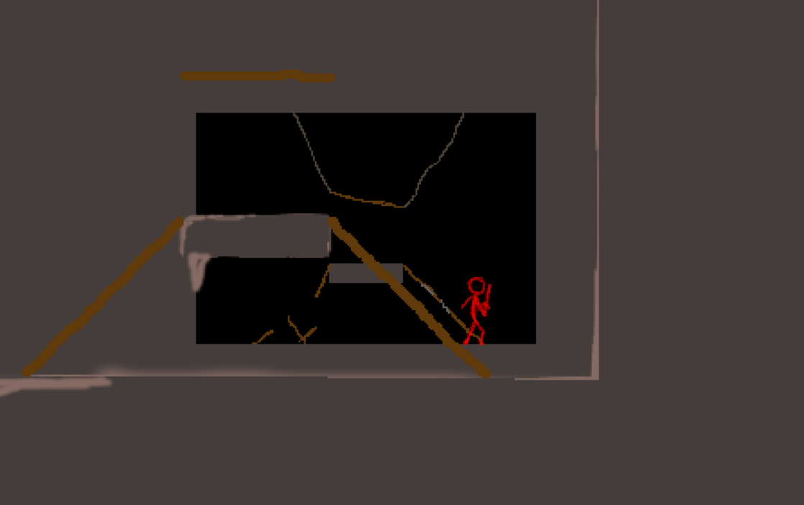

# About

This project is a game developed with **C++** and **SDL 2** library. It is a 2D pixelart platformer, which in future is going to be an online multiplayer game.

## Achived so far

### Graphics (I'm not an artist ;)

* Rendering sprites and simulating depth (background sprites movement is influenced by the camera position)

* Rendering animations in a loop

### Physics

* Fully functional collision model

## Comming next

### Game server and multiplayer gaming

* Development of game server using custom library